# ETA 2824-2 Cade reference reconstruction

This project reconstructs an ETA 2824-2 movement and a simplified watch around
it from published references and explicitly labeled engineering estimates. It is
an educational/reference model, not a manufacturing drawing package.

> **Turn it round yourself.** Open
> [`output/watch-raymarch.html`](output/watch-raymarch.html) in a browser —
> nothing to install, no server, no network. Drag to orbit, wheel to zoom,
> shift-drag to pan; hover a part in the list to light it, click to hide it, and
> the slider explodes the assembly. It is 1.6 MB for all 103 placements because
> the page evaluates the model's own field per pixel rather than carrying a
> mesh, so there is no resolution setting and nothing is faceted. It needs
> **WebGPU** — current Chrome or Edge, or Safari 18+.
>
> **`output/watch.html` is the fallback and it is a poor picture.** It draws the
> same model from a *mesh*, so it needs only WebGL, and it is not committed
> because it is 54 MB. At the resolution that keeps it to that size the page
> reports its own damage: **37 of the 83 parts are under two cells across their
> thinnest feature and are bridged**, and the rotor meshes to nothing and is
> **missing from the picture entirely**. That is the drawing, not the model.
> Regenerate it with `cade view watch.cade -o output/watch.html --part watch
> -n 48`; better costs a lot, since the same command at `-n 64` is 95 MB and at
> `-n 128` is 381 MB.
>
> The raymarched page has none of this, because it has no grid: it evaluates
> the field per pixel, so nothing is bridged and nothing is faceted at any zoom.
> Use it if you can.

> **The STEP and Parasolid files are partial, on purpose.** They hold **43 of
> the model's 83 part definitions** — 54 of its 103 placements. The other 40 are
> not missing from the *model*; they are parts whose boundary cade cannot yet
> state as exact surfaces, and exact B-rep export is still being built out.
> Anything derived from that STEP, the `.x_t` included, inherits the same gap.
> **For the complete geometry use the 3MF**, which holds every placement — see
> [`output/EXPORTS-2026-09-07.md`](output/EXPORTS-2026-09-07.md) for what each
> format does and does not carry.

## Session one — watch it being built

**[ChatGPT designed this parametric watch movement in Cade.](https://www.youtube.com/watch?v=DhmN8472T4A)**
— Yeph Werks. The first session, start to finish.

The written record of that session is in this repository as
[`chatgpt_session_one.md`](chatgpt_session_one.md). What the model has become
since is in [`MODEL_STATUS.md`](MODEL_STATUS.md), which grades every ETA
position as `placeholder`, `estimated` or `supported`, and in
[`ASSUMPTIONS.md`](ASSUMPTIONS.md), which says which numbers are published and
which are estimates.

## Renders

Click any thumbnail for the full-resolution image.

|  |  |  |
|:--:|:--:|:--:|
| [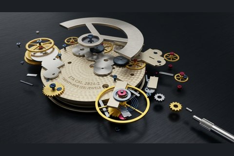](rendered/watch_render.jpeg) **Exploded movement** | [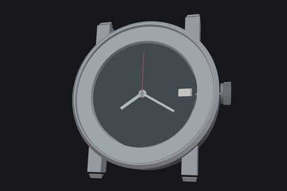](rendered/dial.png) **Dial side** hands and date window | [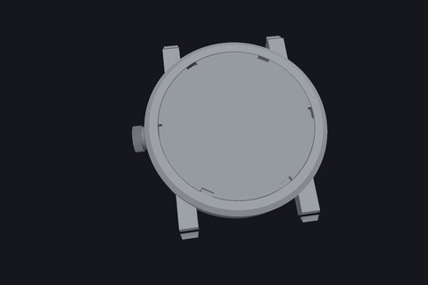](rendered/back.png) **Caseback** closed, from the rotor side |
| [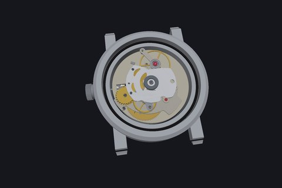](rendered/movement_body.png) **Movement in the case** caseback off | [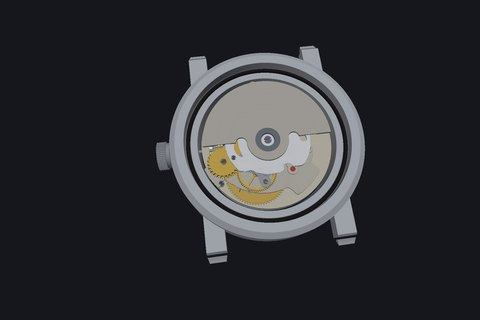](rendered/movement_weight.png) **Rotor in place** the winding weight over the train | [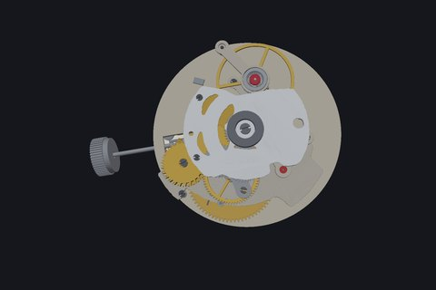](rendered/movement_wo_weight.png) **Rotor removed** the automatic framework beneath |
| [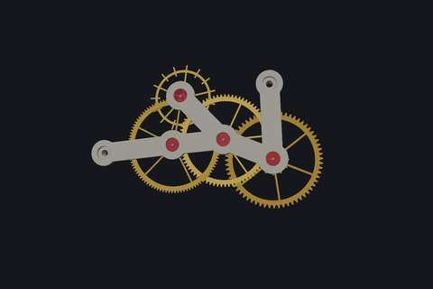](rendered/going_train.png) **Going train** wheels, pivots and jewels alone | [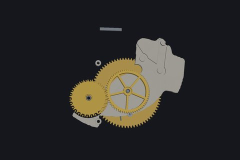](rendered/gears_1.png) **Barrel and winding wheels** under the barrel bridge | [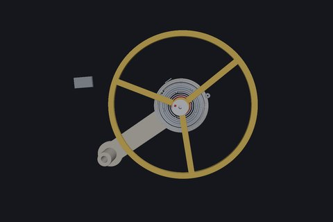](rendered/balance.png) **Balance** rim, staff, hairspring and stud |
| [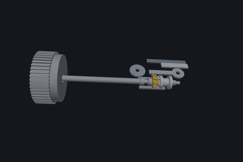](rendered/crown_assembly.png) **Crown and stem** with the keyless works | [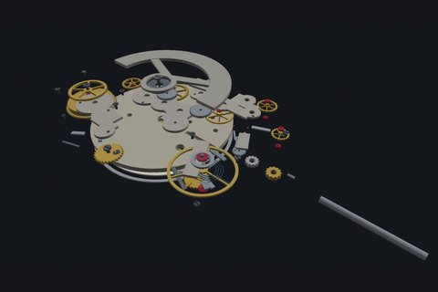](rendered/exploded_view_editor.png) **Exploded view** the same pose in the viewer | [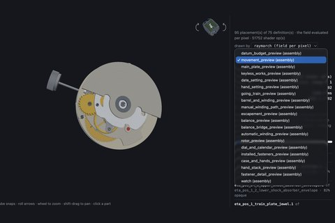](rendered/list_assemblies.png) **The viewer** part picker and per-placement list |

`rendered/thumbs/` holds the small copies only; every link above goes to the
original. The thumbnails are **151 KB for all twelve** against 7.1 MB for the
full set, which is the whole reason they exist — a README that inlined the
originals would cost a reader 7 MB to scroll past.
